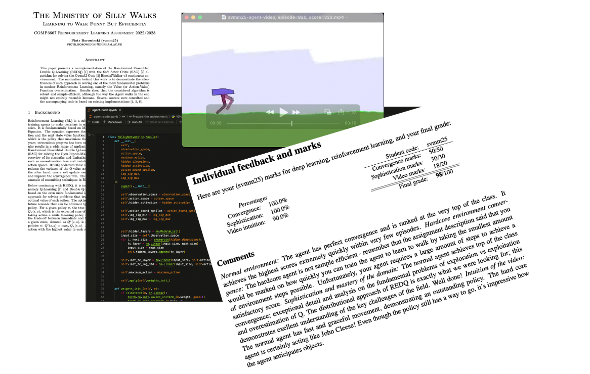
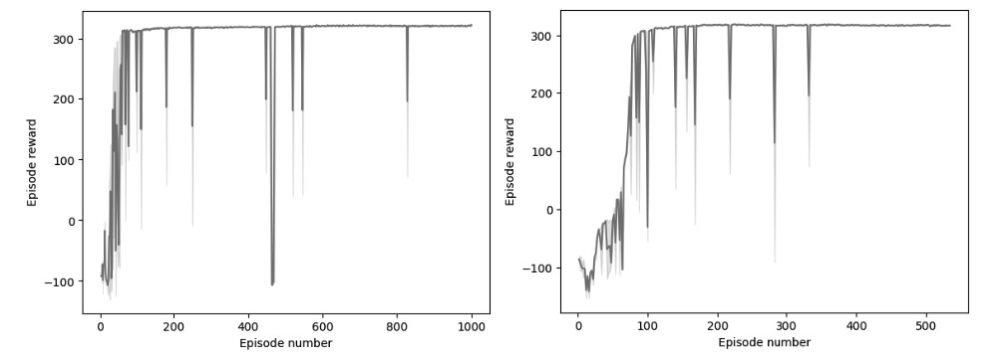
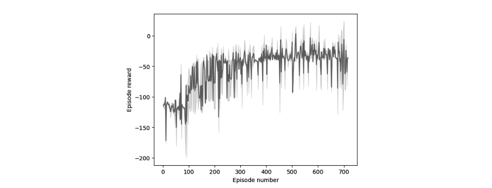

  <h1 align="center">The Ministry of Silly Walks</h1>
  <h3 align="center">COMP3667 Reinforcement Learning Assignment 2022/2023</h3>
  

    <a href="https://github.com/pjborowiecki/COMP3667-Reinforcement-Learning/issues">Report Bug</a>
    ·
    <a href="https://github.com/pjborowiecki/COMP3667-Reinforcement-Learning/issues">Request Feature</a>
  

<!-- TABLE OF CONTENTS -->

  
Table of Contents

  <ol>
    <li>
      <a href="#about-the-project">About The Project</a>
    </li>
    <li>
    <a href="#feedback-received">Feedback Received</a>
    </li>
    <li><a href="#contributing">Contributing</a></li>
    <li><a href="#license">License</a></li>
    <li><a href="#contact">Contact</a></li>
  </ol>

<!-- ABOUT THE PROJECT -->

## About The Project

This repository contains my final submission for the **COMP3667 Reinforcement Learning** module assignment at Durham University in the academic year 2022/2023. The project focuses on solving the [OpenAI Gym](https://github.com/openai/gym) [BipedalWalker-v3 environment](https://www.gymlibrary.dev/environments/box2d/bipedal_walker/). BipedalWalker-v3 is a classic task in robotics that performs a fundamental skill: moving forward as fast as possible. The goal was to get a 2D biped walker to walk seamlessly through rough terrain in as little training episodes as possible. The environment is considered solved when the agent achieves an average reward of 300 over 100 consecutive episodes.

The repository contains both the code in an `.ipynb` format, and the report in a `.pdf` format. Implementation details are thoroughly described in the report, which I encourage you to read to fully understand the problem. In short, the repo presents an adaptation of an excellent Randomized Ensembled Double Q-Learning ([REDQ](https://arxiv.org/abs/2101.05982)) with the Soft Actor Critic ([SAC](https://arxiv.org/abs/1801.01290)) algorithm for solving the OpenAI Gym BipedalWalker-v3 continuous environment. The motivation behind this work is to demonstrate the effectiveness of such approach in solving one of the most fundamental problems in modenr Reinforcement Learning, namely the Value (or Action-Value) Function overestimation. Results show that the considered algorithm is robust and sample-efficient, although the way the Agent walks in the end might not entirely resemble humans. The code is written in Python with the [PyTorch](https://pytorch.org/) library.

The algorithm is sample efficient and converges fast in simple environments. The results are consistent with every code run, with negligible differences. First positive rewards can be observed after 18 epochs of training already, and the environment gets solved in around 73 episodes. Lower scores appear every now and then as a result of temporarily abandoning the policy for exploration, but the Agent returns to the policy right after and overall maintains the rewards above 300. Around 120 minutes of training are required to achieve this, with a single episode run time being empirically observed to range from 1 to 4 minutes initially. The episode run time increases the longer we train, resulting in 1,000 episodes being achieved in roughly 74 hours (4488 minutes). The training ends with the reward of 323, and - discounting occasional drop - episode rewards oscillate between 318 and 323 for most of it. A chart below shows exact score history across 1,000 episodes of training, with the random_action_steps parameter being set to 1,000 (on the left), and the score history across 5340 episodes, with the same parameter being set to 4,000 (on the right).

In terms of the hardcore environment, a clear uptrend in progress was initially observed, but the algorithm appears to have plateaued around episode 300, with a reward oscillating between -129 and 24, and the mean being equal to -36. Judging from the videos recorded, it could be inferred that the agent gets stuck in local minima, where it learns how to avoid falling, but approaches obstacles in a way, that prohibits him from leaving them and continuing the run. It is possible that with longer training time, a breakthrough and further progress could be achieved, leading to environment being solved, but the training had to be stopped due to limited resources. A chart below shows exact score history across 717 episodes of training.

Despite excellent convergence properties and consistent results in the simple environment, the Agent does not appear to run, but rather jumps, resembling ”The Ministry of Silly Walks” sketch from Monty Python’s Flying Circus, as can be seen in the accompanying video recording. Nonetheless, it is quick and clearly learned to walk efficiently, achieving high rewards. The algorithm was less successful in the hardcore environment, which remained unsolved after 500 episodes of training. As already mentioned, it is possible that environment would have been solved with longer training. One approach could be to start the hardcore environment training with the agent already trained on basic environment. Allowing the agent to explore more could also help.

Methodical hyperparameter tuning should be performed, as the current values were cho- sen arbitrarily or as a result of emirical experimentation. Different Q-Network and Policy Network architectures were tried, but with no systematical approach allowing for strong conclusions to be made. [Prioritized Experience Replay (PER)](https://arxiv.org/abs/1511.05952) could be implemented in place of the current Replay Buffer. Other popular algorithms, such as [Twin Delayed Deep Deterministic policy gradient algorithm (TD3)](https://arxiv.org/abs/1802.09477), [Asynchronous Advantage Actor-Critic algorithm (A3C)](https://arxiv.org/abs/1602.01783), or [Proximal Policy Optimization algorithm (PPO)](https://arxiv.org/abs/1707.06347) could also be tried with REDQ. A thorough comparison could then be performed, leading to selecting the best candidate before tuning it further.

 
<!-- FEEDBACK RECEIVED -->

## Feedback received

Normal environment: The agent has perfect convergence and is ranked at the very top of the class. It achieves the highest scores extremely quickly within very few episodes. Hardcore environment conver- gence: The hardcore agent is not sample efficient - remember that the assignment description said that you would be marked on how quickly you can train the agent to learn to walk by taking the smallest amount of environment steps possible. Unfortunately, your agent requires a large amount of steps to achieve a satisfactory score. Sophistication and mastery of the domain: The normal agent achieves top of the class convergence; exceptional detail and analysis on the fundamental problems of exploration vs exploitation and overestimation of Q. The distributional approach of REDQ is exactly what we were looking for; this demonstrates exellent understanding of the key challenges of the field. Well done! Intuition of the video: The normal agent has fast and graceful movement, demonstrating an outstanding policy. The hard core agent is certainly acting like John Cleese! Even though the policy still has a way to go, it’s impressive how the agent anticipates objects.

- Convergence marks: 50/50
- Sophistication marks: 30/30
- Video marks: 18/20
   
  
- **Final grade: 98/100**

 
<!-- CONTRIBUTING -->

## Contributing

Contributions are what make the open source community such an amazing place to learn, inspire, and create. Any contributions you make are **greatly appreciated**.

If you have a suggestion that would make this better, please fork the repo and create a pull request. You can also simply open an issue with the tag "enhancement".
Don't forget to give the project a star! Thanks again!

1. Fork the Project
2. Create your Feature Branch (`git checkout -b feature/AmazingFeature`)
3. Commit your Changes (`git commit -m 'Add some AmazingFeature'`)
4. Push to the Branch (`git push origin feature/AmazingFeature`)
5. Open a Pull Request

(<a href="#readme-top">back to top</a>)

<!-- LICENSE -->

## License

Distributed under the MIT License. Of course, I do not claim rights or ownership to neither the BipedalWalker-v3 environment, which is a part of the OpenAI Gym library, nor the REDQ algorithm or any other resources used in this project. Many of these resources are listed at the start of the accompanying `.ipynb` file, and also referenced throughout the report.

(<a href="#readme-top">back to top</a>)

<!-- CONTACT -->

## Contact

Piotr Borowiecki - [@pjborowiecki](https://twitter.com/pjborowiecki) - hello@pjborowiecki.com

(<a href="#readme-top">back to top</a>)

<!-- ACKNOWLEDGMENTS -->
